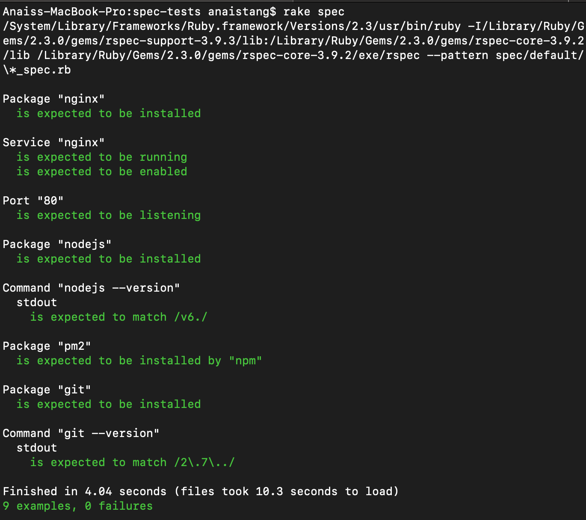

# Syncing Folders from OS to VM 
 `config.vm.synced_folder "app", "/app"`

The above command will sync OS app to VM


## App folder synced with VM 

## Communication with Devs
- What languague is used to build the app
- What framework has been used 
- Are there any dependencies (imported modules) to be installed together 
- What will the app look like 

# Installing Packages

1. Log into your (ve) Server via SSH as the root user
`ssh root@hostname`
`sudo -i`

2. Use apt-get to update your (ve) Server
`root@ubuntu-xenial:~# apt-get update`

3. Installing `nginx`
`root@ubunt-xenial:~# apt-get install nginx`
`service nginx start`

4. Test `nginx`
`sudo nginx -s reload`
**or**
`sudo service nginx reload`
**sudo systemctl status nginx.service**

**Installation**
First run as admin 
`$ vagrant@vagrant-ubuntu-trusty-64: ~$sudo -i`
`$ vagrant plugin install vagrant-hostsupdater`

Uninstall with:
`$ vagrant plugin uninstall vagrant-hostsupdater`

Update the plugin with:
`$ vagrant plugin update vagrant-hostsupdater`

## Usage 
```bash
config.vm.network :private_network, ip: '192.168.3.10'
config.vm.hostname = 'www.test.com'
config.hostsupdater.aliases = ["aliases.test"]
```

## Installing dependencies `ruby`
```bash
Anaiss-MacBook-Pro:spec-tests anaistang$ sudo -i
Anaiss-MacBook-Pro:spec-tests anaistang$ gem install bundler
```

## Installing V6 Nodejs
```bash
root@ubuntu-xenial:~# curl -sL https://deb.nodesource.com/setup_6.x | sudo -E bash -
root@ubuntu-xenial:~# npm install pm2 -g
```

## Running tests with Rake
- Rake is a build tool for Ruby
- Rake task runs a set of specs 


